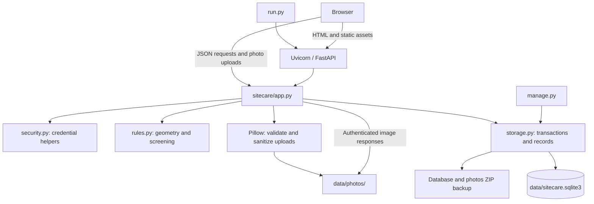
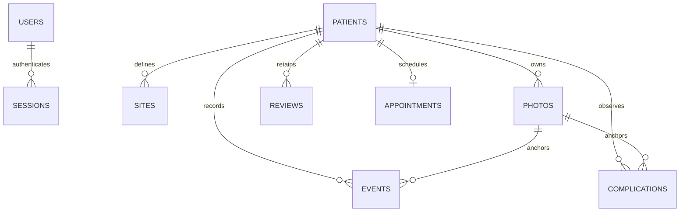
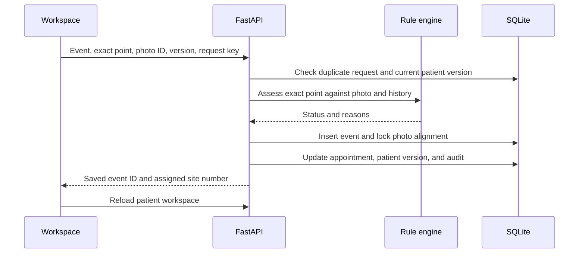

# SiteCare Architecture

For the current comprehensive reference, including the database model and API/workflow diagrams, see [technical_architecture.md](technical_architecture.md). This file retains the earlier architecture notes.

This document describes the current implementation of SiteCare, version `1.0.0-prototype`, including numbered candidate rotation and the shared demonstration clock.

## 1. Purpose and runtime

SiteCare is a desktop-local web application for documenting abdominal puncture sites, photographs, skin observations, and appointment plans. It has Japanese and English interfaces. Site suggestions use deterministic software checks; there is no AI model or automatic image diagnosis.

The application runs as one Python server on `127.0.0.1:8000`. A browser provides the interface. Records are stored in SQLite and photographs in local files. No Node.js build, external database server, or cloud service is required.

The application is a demonstration prototype, not a clinically validated decision-support or medical-record system. The rules below describe software behavior rather than an independently established treatment protocol.

## 2. System overview



## 3. Source map

| Path | Responsibility |
| --- | --- |
| `run.py` | Parses launch options, creates the application, starts Uvicorn, and optionally opens a browser. |
| `manage.py` | Provides backup, database/image integrity checks, and local password reset. |
| `sitecare/app.py` | Application factory, middleware, API routes, input validation, authorization, and workflow coordination. |
| `sitecare/clock.py` | Request-scoped application clock, with separate real time for authentication. |
| `sitecare/rules.py` | Time and coordinate utilities, site eligibility, rest countdowns, and candidate ranking. |
| `sitecare/storage.py` | SQLite schema, connection handling, transactions, serialization, audit writes, and backups. |
| `sitecare/security.py` | Password hashing/verification and session-token hashing. |
| `sitecare/demo.py` | Creates fictional demo records and a schematic photograph. |
| `templates/index.html` | HTML shell loading the CSS and JavaScript entry module. |
| `static/app.js` | Login, navigation, overview, patient list, appointments, settings, audit, and help. |
| `static/workspace.js` | Photo alignment, SVG overlay, site selection, exact-point screening, and record dialogs. |
| `static/clock-ui.js` | Shared date/time dialog and visible clock indicator. |
| `static/ui.js` | Shared UI state, API wrapper, translations, dialogs, formatting, icons, and notifications. |
| `static/style.css` | Typography, component styles, responsive layouts, and print styles. |
| `tests/` | Rule-engine and API regression tests with synthetic fixtures and temporary databases. |
| `docs/` | Workflow guide, technical notes, packaging test report, and demonstration screenshot. |
| `samples/` | Synthetic practice photograph. |

The backend uses direct SQL through Python's `sqlite3` module. There is no ORM or separate repository/service framework. Most workflow orchestration resides in `app.py`.

## 4. Frontend architecture

The browser loads native JavaScript modules directly. Navigation uses URL fragments such as `#dashboard`, `#patients`, and `#patient/1`; the server serves the same HTML entry page.

`app.js` selects the page and mounts the patient workspace when needed. `mountWorkspace()` owns the current photo, alignment, selection, draft edits, and server response. It returns a cleanup function to remove timers and unload listeners when leaving the workspace.

The workspace renders an SVG photograph and overlay in a patient-relative coordinate plane. Separate groups contain saved site graphics and temporary interaction graphics. Four independent curved paths each use an SVG end marker for the green direction arrows.

The browser redraws countdown-related content every 30 seconds and polls patient state every 60 seconds while visible. It compares patient versions to detect competing edits and uses the server timestamp to compensate for browser-clock differences. Background polls do not refresh the session's idle timeout.

Shared interface state holds the authenticated user, CSRF token, language, and server time. Only the language preference is explicitly persisted in browser local storage. Current typography uses a 16 px base, mostly 16 px buttons/forms/table text, and smaller supporting labels. Overlay annotations use SVG coordinate units rather than CSS pixels.

## 5. API surface

All routes are declared inside `create_app()` in `sitecare/app.py`. Automatic OpenAPI and Swagger pages are disabled.

| Area | Routes |
| --- | --- |
| Application clock | `GET/POST /api/clock` (changes require administrator role) |
| Session | `GET /api/bootstrap`, `POST /api/setup`, `/api/login`, `/api/logout`, `/api/heartbeat` |
| Patients | `GET/POST /api/patients`, `GET/PATCH/DELETE /api/patients/{patient_id}` |
| Photos | `POST /api/patients/{patient_id}/photos`, `GET /api/photos/{photo_id}/image`, `POST /api/photos/{photo_id}/alignment` |
| Layout and screening | `POST /api/patients/{patient_id}/layout`, `/api/patients/{patient_id}/screen-point` |
| Puncture records | `POST /api/patients/{patient_id}/events`, `/api/events/{event_id}/void` |
| Skin observations | `POST /api/patients/{patient_id}/alerts`, `/api/alerts/{alert_id}/resolve` |
| Legacy recurrence review | `POST /api/patients/{patient_id}/reviews` |
| Appointments | `GET /api/appointments`, `POST /api/patients/{patient_id}/appointment` |
| Export and administration | `GET /api/patients/{patient_id}/export.csv`, `/api/audit`, `/api/backup`; `GET/POST /api/users`; `POST /api/demo` |

The patient detail response assembles the profile, sites, events, alerts, reviews, photos, calculated site states, candidates, appointment, policy information, and current server time.

## 6. Database and files



| Table | Stored information |
| --- | --- |
| `schema_info` | Database schema version, currently 1. |
| `app_clock` | Singleton persisted UTC offset, selected timestamp, and clock revision; null offset means system time. |
| `id_sequences` | Monotonic record ID counters, preserving identity across patient deletions. |
| `pending_photo_deletions` | Committed photo-file deletions awaiting cleanup or restart retry. |
| `users` | Username, display name, password hash, and `admin` or `nurse` role. |
| `sessions` | Hashed token, CSRF token, user reference, creation time, and last activity. |
| `patients` | Unique code, alias, notes, therapy text, initial due date, active/demo flags, and edit version. |
| `sites` | Fourteen numbered coordinates per patient. |
| `photos` | Filename, dimensions, capture/upload times, alignment JSON, verification, and alignment lock. |
| `events` | Exact puncture coordinates, assigned number, timestamps, actor, notes, warnings, alignment snapshot, request key, and void metadata. |
| `complications` | Circular alert geometry, types, severity, timestamps, alignment snapshot, and recovery metadata. |
| `reviews` | Retained per-site recurrence review records; no longer required to unblock resolved alerts. |
| `appointments` | One current appointment per patient, with separate calculated due and scheduled times. |
| `audit` | Actor, action, entity, optional patient identifier, timestamp, and JSON details. |

Photo bytes are stored separately under `data/photos/`; the database stores their generated filenames. Audit patient identifiers are not declared foreign keys. Site numbers in event/alert records are stored values rather than composite foreign-key references to `sites`.

SQLite uses WAL mode, foreign-key enforcement, and a 15-second busy timeout. Write transactions begin with `BEGIN IMMEDIATE` and commit or roll back together. Initialization creates missing tables and rejects unsupported schema versions; there is no incremental migration framework.

## 7. Geometry and screening

### Coordinates and photo calibration

The navel is `(0, 0)`. Positive x points toward image right/patient left; positive y points toward the feet. Coordinates are in approximate centimetres.

Alignment stores navel pixel coordinates (`cx`, `cy`), pixels per centimetre (`ppm`), rotation (`angle`), and ruler calibration points. The server derives `ppm` from the ruler endpoints and entered length rather than trusting a client-supplied scale. The transform supports translation, rotation, and uniform scale; it does not correct posture, perspective, or body curvature.

### Current rules

| Check | Behavior |
| --- | --- |
| Site reuse | A numbered site rests for 12 x 24 hours after use. |
| Recent exact points | Points less than 2.5 cm from a puncture within its rest window are restricted, even across numbered sites. |
| Navel exclusion | Points less than 5 cm from the navel are blocked. |
| Active skin alert | A point within an unresolved alert circle is blocked. |
| Photo geometry | A point outside the photo bounds is blocked. |
| Photo readiness | Screening requires verified ruler calibration and a photograph captured within the last 24 hours. |
| Repeated observations | History remains available, but repeated episodes do not impose a review hold. |

Status precedence is `blocked`, then `resting`, then `unverified`, then `eligible`. Responses include the contributing reasons and the latest applicable rest-unlock time.

**Unblocking:** Recording recovery clears that alert's restriction immediately. No extra "two related episodes in 90 days" review is required. Other unresolved alerts, rest periods, and photo/geometry checks remain independent. Existing recurrence-review records and the API are retained for compatibility; `needs_review` is always false. Related observations within 90 days contribute only to informational counts.

Candidate selection returns at most three eligible numbered sites, ordered by numbered rotation after the latest applicable puncture, wrapping from 14 to 1. Resolved complications and older use do not lower a site's rank. For example, resolving site 5 changes eligible candidates 3, 4, 6 to 3, 4, 5. It never fills missing slots with blocked sites.

## 8. Main write workflows

### Upload and alignment

1. Validate authorization, patient version, capture time, consent, and uploaded file.
2. Accept actual JPEG/PNG images under the upload limit, at least 200 pixels per side and no more than 32 megapixels.
3. Apply EXIF orientation, resize to fit within 2560 x 2560, strip metadata, and write a sanitized JPEG.
4. Save photo metadata with initially unverified alignment.
5. Validate ruler calibration and explicit alignment confirmation before marking the photo verified.

### Record a completed puncture



New-procedure records require the latest current photo and passing checks. A photo cannot receive a second non-voided new-procedure record. Historical mode records already-performed events with an explanation and preserved warnings. It is distinct from passing current-procedure screening.

Saved event and alert records contain alignment snapshots. Referenced photo alignment is locked, and patient layout editing is locked once records exist. Event corrections retain the original entry with void metadata rather than deleting it.

### Default layout and interface labels

`POST /api/patients/{patient_id}/layout` accepts either `sites` for a custom layout or `reset_to_default: true` with the current patient `version`. The reset obtains its coordinates directly from `rules.default_sites()`, validates them through the same path as custom layouts, and applies the same record lock and version checks. The transaction updates all positions and the patient version, and writes `layout.reset_to_default` with before/after coordinates. It does not change photo alignment.

The workspace's blue **Default Layout** button saves this reset immediately, reloads the map, clears any selected old point, and retains unsaved photo alignment. Red **Save 14-Site Layout** saves custom positions; yellow **Discard Changes** reloads the last saved layout and alignment.

English interface labels use a capital initial for each word, including words joined by hyphens. Keep this convention for new buttons, options, headings, tabs, statuses, field labels and accessible names. Write these labels explicitly in the translation source so screen readers receive the same wording; do not apply case conversion to patient-entered data or stored values. Preserve acronyms such as ID, CSV and JST and measurement symbols such as cm and px. Japanese translations and explanatory prose retain their usual casing. Map notice labels use 12px text (11px at the small-screen breakpoint).

### Recovery and appointments

Alert resolution records explicit recovery confirmation, an assessment note, actor, and timestamp, then increments the patient version and writes an audit entry. The next workspace response recalculates eligibility without a recurrence hold.

Appointment due time is the latest non-voided puncture time plus 72 hours, or the patient's initial due time when no puncture exists. Confirming a different scheduled time requires a reason and preserves the calculated due time. Calendar projections are generated at three-day intervals; they are not separate confirmed bookings or outbound reminders.

## 9. Security and consistency

- The launcher binds to loopback; middleware also restricts accepted hostnames.
- Passwords use salted scrypt hashes. Session tokens are random and stored as SHA-256 hashes.
- Session cookies are HTTP-only and SameSite Strict. Sessions expire after 30 minutes idle or eight hours total.
- Writes require a session CSRF token and reject a conflicting Origin header.
- Authentication is required for patient data and images. Administrative operations check the account role.
- Patient-version checks reject stale edits with HTTP 409. Event request keys make duplicate submissions idempotent.
- Responses set cache, framing, content-type, referrer, and content-security headers.
- CSV exports guard against spreadsheet formula injection.

Database files, photos, backups, and audit entries are not encrypted or protected against alteration by someone with filesystem access. The application has no hospital identity integration or per-patient access assignment model.

## 10. Operations and verification

Run from the project root on Windows:

```powershell
.\.venv\Scripts\python.exe run.py
.\.venv\Scripts\python.exe run.py --port 8001 --no-browser
.\.venv\Scripts\python.exe manage.py check
.\.venv\Scripts\python.exe manage.py backup
.\.venv\Scripts\python.exe -m pytest -q
```

Both server and maintenance commands accept `--data-dir`; use the same directory for both. Frontend changes are served directly and require a browser refresh. Backend changes require restarting the normal launcher because it does not enable automatic reload.

Backups use SQLite's snapshot API and include the photo files referenced by that snapshot. Login sessions are removed from the backup copy. Restoration is manual: stop the application and replace the full data directory from a backup rather than merging unrelated databases and photos.

The test suite uses FastAPI TestClient, synthetic images, and temporary databases. It covers screening boundaries, uploads, alignment, authentication, concurrency conflicts, recording, recovery, appointments, export, backups, and the shared clock. After the candidate-order and demonstration-clock changes, the local suite completed with **86 passed**, with one dependency deprecation warning. A browser smoke check verified date selection, dashboard/calendar refresh, system-date reset, and workspace rendering using a temporary synthetic installation. This is not a complete browser regression or clinical validation.

## 11. Where to make changes

| Change | Primary files |
| --- | --- |
| Fonts, spacing, responsive layout | `static/style.css` |
| Photo controls, overlay graphics, record dialogs | `static/workspace.js` |
| Dashboard, appointments, navigation, settings | `static/app.js` |
| Shared text, formatting, API handling | `static/ui.js` |
| Eligibility and candidate ordering | `sitecare/rules.py`, `tests/test_rules.py` |
| Validation, endpoints, workflow behavior | `sitecare/app.py`, `tests/test_api.py` |
| Schema, transactions, backup format | `sitecare/storage.py` |

When changing a rule, keep server behavior, UI explanations, regression tests, and documentation consistent. Schema changes need an explicit migration approach before applying them to existing local data.

## 12. Application date and time

The shared date bar offers **Change date** to administrators. System mode follows the computer clock. Manual mode accepts a JST date/time and stores its offset from real UTC; time continues running from that chosen instant, including across restarts. **Use system date** removes the offset. No operating-system clock changes are made.

The offset is loaded from `app_clock` for each request and applied through a ContextVar. It drives screening, rest countdowns, photo freshness, event validation/timestamps, recovery times, appointments, calendars, demo generation, and audit times. Authentication/session expiry and login throttling use real time. Clock-change audits also retain the real system timestamp.

Responses expose the effective time, mode, and revision in headers. The browser anchors this time to its monotonic clock, uses it for all default date fields, and checks for shared-clock changes every 15 seconds, on focus, and after changes from another tab. Clock revisions and patient versions reject stale saves. Open dialogs and unsaved photo alignment are retained until dismissed or refreshed.

Existing records keep their timestamps. When moving backward, events/alerts after the chosen time do not affect current screening; resolutions and voids take effect at their recorded times. The latest applicable photo is selected by capture time. Appointment due dates are derived from the latest applicable puncture without overwriting saved appointment confirmations just to preview another date. Full histories remain available; this is not a versioned reconstruction of every past profile or alignment edit.

Advancing beyond the 24-hour photo limit correctly makes the photo stale. Upload and verify a synthetic visit photo captured at the demonstration time to continue the scenario. Active alerts do not heal just because the clock advances.

## 13. Administrator patient deletion

An administrator opens a patient, chooses **Profile**, then **Delete patient…**. A second dialog shows the saved name/ID, photo/event/alert counts, and deletion scope. The administrator types the exact patient code to enable **Delete permanently**. A reason can be recorded. Nurse accounts do not see this control and cannot call the endpoint.

`DELETE /api/patients/{patient_id}` requires authentication, administrator authorization, CSRF, the current patient version, and the matching `confirm_code`. The transaction removes events, complications, recurrence reviews, the appointment, site coordinates, photo metadata, and the patient profile. It preserves previous audit entries and adds `patient.deleted` with the administrator, patient identity, counts, and optional reason. Existing backup archives are unchanged. There is no in-app undo.

Photo filenames are queued in the same database transaction and removed from the photos directory after commit. File paths must resolve directly within that directory. A locked file leaves a durable cleanup entry and produces a visible warning; application startup retries pending cleanup. Missing files count as already removed. Database rollback leaves the photos untouched.

Record IDs for patients, photos, events, and complications are allocated using persistent counters to prevent old links or audit identifiers from referring to newly created records. Initialization seeds counters from existing database maxima without changing existing IDs. Demo creation uses the same allocator and handles reloading the primary demo after deletion.

Backup creation holds a database write lock while taking a snapshot and copying its referenced photographs, preventing a concurrent deletion from invalidating a backup in progress. Deletion tests use temporary synthetic databases and cover permissions, confirmation, stale edits, dependent data, file cleanup/retry, rollback, ID reuse, demo reload, and backup coordination.
