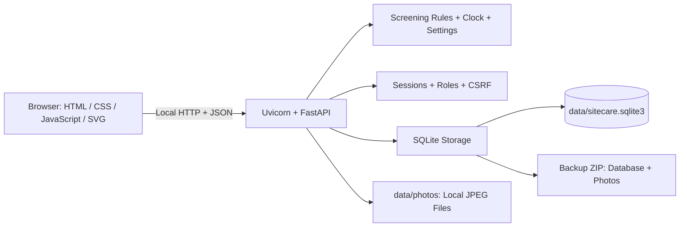
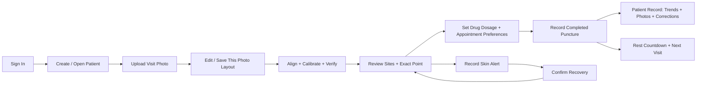

# SiteCare Prototype

A local, bilingual web application for documenting abdominal puncture sites, reviewing a 14-site photo overlay, and planning visits.

**GitHub:** [ShabbirMahmood/SiteCare_Prototype](https://github.com/ShabbirMahmood/SiteCare_Prototype)

## Start

Open the project folder in VS Code and use a **Command Prompt** terminal. With Python 3.13 installed:

```bat
py -3.13 -m venv .venv
.venv\Scripts\activate
python.exe -m pip install -r requirements.txt
python.exe run.py
```

Open [SiteCare](http://127.0.0.1:8000/). On a fresh installation, create the administrator account; no account is built in. Stop the server with **Ctrl+C** in its terminal.

For an existing installation, activate its environment and run `python.exe run.py`. See [Setup Instructions](setup_instruction.md) for Python versions, account details, password resets, and port recovery.

## Features

- Patient profiles, photo numbering from #1 per patient, and a separate editable 14-site layout for each new photo.
- Manual alignment, ruler calibration, exact-point records, and skin-alert recovery.
- Up to three candidates in numbered rotation order, rest countdowns, and appointments.
- Shared demonstration date, shared Keep Calibration enabled by default, English/Japanese interface, and administrator patient deletion.
- Patient-specific dosage presets and recorded flow rates, adjustable appointment rules, and monthly/yearly patient reports.
- Circular/elliptical skin alerts with independent Pain and Tenderness observations, historical photo overlays, and auditable record corrections.
- Local accounts, nurse-account deletion, readable audit history, expanded CSV export, and database/photo backups.

## Architecture



## Workflow



## Photos and Calibration

Photo labels are local to each patient: patient A has **#1, #2, #3**, and patient B starts again at **#1**. They represent upload order, including existing photos. Internal database IDs stay unchanged so records continue to link to the correct image.

On every new photo, **Edit Sites** and the four bottom controls are available: **Verify & Save Alignment**, **Discard Changes** (yellow), **Save Site Layout** (red), and **Default Layout** (blue). Once a record uses that photo, its layout and alignment become read-only. A later upload gets its own editable copy; earlier images and records retain their saved geometry.

**Keep Calibration** is enabled by default and available at the top for nurses and administrators. Administrators also see **Change Date**:

| Setting | Behavior |
| --- | --- |
| Unchecked | The current photo must be within 24 hours of the application clock. A new procedure also needs a photo without an existing non-voided procedure record. |
| Checked — default | Reuse the latest verified photo beyond 24 hours and for later procedures. Its saved layout/alignment stay protected. |
| New photo uploaded | Calibrate and verify this new image in either mode. Calibration is never copied between different images. |

The setting applies to all patients, is saved across restarts, and takes effect when changed. Site rest, exact-point spacing, skin alerts and all other record checks still apply. **Change Date** affects photo age as well as countdowns and appointments.

## Patient Options And Reports

- **Draw Alert:** click the spot centre and enter full width/height in cm (both default 0.30). Width controls height until height is edited separately. **Draw Spot** measures an ellipse from a mouse-drawn bounding box.
- **Drug Dosage:** select Higher/Standard/Lower, set a rate (initially 0.15 mL/h) and step (initially 0.01 mL/h). Increases/decreases require a reason. Saving a puncture records the preset and carries its rate forward for that patient.
- **Appointment:** choose Count Days (default 3) or one or more weekdays. Only the next appointment is suggested; no recurring forecasts are generated.
- **Patient Record:** Month View shows each recorded rate; Year View averages by month; Total View averages by year. Filter by site, review numerical tables, count skin episodes, view dated photo overlays, and manage corrections. Rates are mL/h; averages are not delivered volume.
- **Manage Records:** administrators can edit or logically delete individual records with a reason. Original values remain in correction history. See [Data Policy](docs/DATA_POLICY.md) and the [Bilingual Feature Guide](docs/PATIENT_RECORDS.md).

## Everyday Operation

1. Sign in and open the existing patient profile for each visit.
2. Upload and prepare a new photo, or use an existing verified photo when Keep Calibration is enabled.
3. Review the three candidate suggestions and the exact point before documenting a completed procedure.
4. Record skin observations and explicitly confirm recovery when appropriate. Recovery returns an otherwise eligible site to its numbered candidate position immediately.
5. Save changes before closing. Stop the Python server in its terminal with **Ctrl+C**.

The first start after this update upgrades SQLite to schema version 2. Existing records and photos are retained; older unknown dosage values remain unknown. Keep Calibration is enabled once during the upgrade.

Back up through **Settings & Data → Download Complete Backup** or `python.exe manage.py backup`. Keep the complete `data/` folder when updating the application. Restart the server and press **Ctrl+F5** after installing source changes.

## Guides

| File | Purpose |
| --- | --- |
| [user_manual.md](user_manual.md) | Short user guide in English and Japanese |
| [setup_instruction.md](setup_instruction.md) | VS Code setup, login, stopping, and maintenance |
| [technical_architecture.md](technical_architecture.md) | Detailed file map, database, APIs, rules, and workflows |
| [docs/TEST_REPORT.md](docs/TEST_REPORT.md) | Recorded verification results |

Python serves both the API and interface; no Node.js build, database server, or cloud account is required. Data stays in the installation's `data` folder. The application binds to `127.0.0.1` and displays workflow dates in **Japan Standard Time**.

**Prototype scope:** use synthetic or appropriately de-identified data. Photo measurements are approximate, and a green site means only that software checks passed. This application is not clinically validated. Data and backups are not encrypted by the application.
