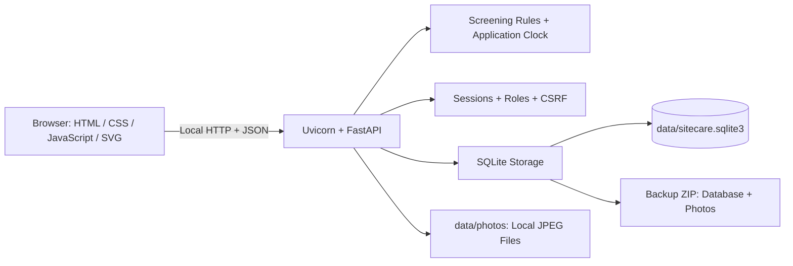
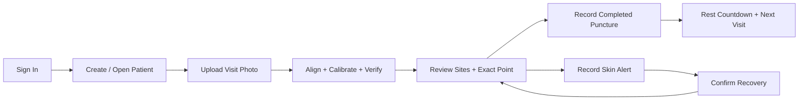

# SiteCare Prototype

A local, bilingual web application for documenting abdominal puncture sites, reviewing a 14-site photo overlay, and planning visits.

**GitHub:** [ShabbirMahmood/SiteCare_Prototype](https://github.com/ShabbirMahmood/SiteCare_Prototype)

## Start

Open the project folder in VS Code and use a **Command Prompt** terminal. With Python 3.13 installed:

```bat
py -3.13 -m venv .venv
.venv\Scripts\activate
python.exe -m pip install -r requirements.txt
python.exe run.py
```

Open [SiteCare](http://127.0.0.1:8000/). On a fresh installation, create the administrator account; no account is built in. Stop the server with **Ctrl+C** in its terminal.

For an existing installation, activate its environment and run `python.exe run.py`. See [Setup Instructions](setup_instruction.md) for Python versions, account details, password resets, and port recovery.

## Features

- Patient profiles, visit photographs, and an editable 14-site layout with a default reset.
- Manual alignment, ruler calibration, exact-point records, and skin-alert recovery.
- Up to three candidates in numbered rotation order, rest countdowns, and appointments.
- Shared demonstration date, English/Japanese interface, and administrator patient deletion.
- Local accounts, audit history, patient CSV export, and database/photo backups.

## Architecture



## Workflow



## Guides

| File | Purpose |
| --- | --- |
| [user_manual.md](user_manual.md) | Short user guide in English and Japanese |
| [setup_instruction.md](setup_instruction.md) | VS Code setup, login, stopping, and maintenance |
| [technical_architecture.md](technical_architecture.md) | Detailed file map, database, APIs, rules, and workflows |
| [docs/TEST_REPORT.md](docs/TEST_REPORT.md) | Recorded verification results |

Python serves both the API and interface; no Node.js build, database server, or cloud account is required. Data stays in the installation's `data` folder. The application binds to `127.0.0.1` and displays workflow dates in **Japan Standard Time**.

**Prototype scope:** use synthetic or appropriately de-identified data. Photo measurements are approximate, and a green site means only that software checks passed. This application is not clinically validated. Data and backups are not encrypted by the application.
