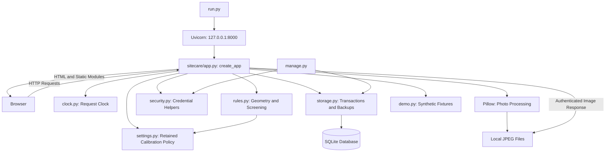
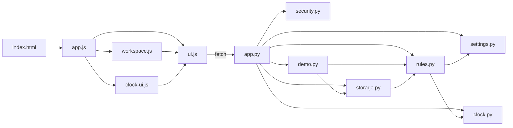
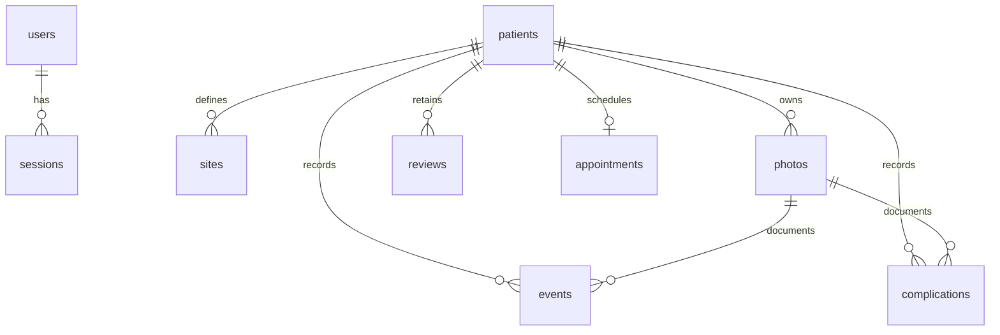
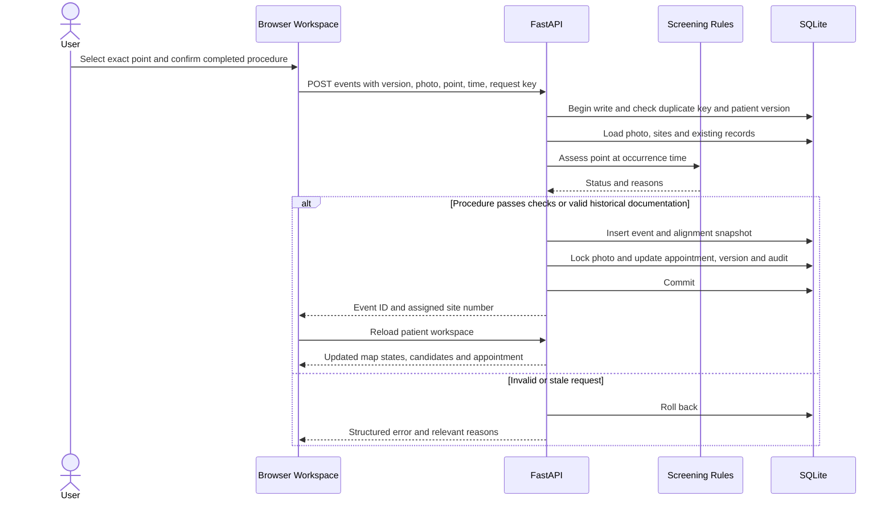

# SiteCare Technical Architecture

Implementation reference for the current local prototype, reviewed against the source on **2026-09-20**.

[Project Overview](README.md) · [User Manual](user_manual.md) · [Setup Instructions](setup_instruction.md)

## 1. System Purpose and Boundaries

SiteCare documents puncture sites on an abdominal photograph. A persistent patient-relative map holds 14 numbered positions, exact puncture points, and circular skin observations. The application screens possible positions against recorded restrictions and proposes future visits.

It is a **single-computer web application**: a Python process serves a browser interface and owns local storage. Multiple accounts and browser windows can use the same installation, but this is not a distributed or cloud system. The standard launcher exposes only `127.0.0.1`.

The screening engine is deterministic Python code. There is no machine-learning model, automatic diagnosis, anatomical registration, or background scheduling service. Results depend on the records, manual alignment, and application clock.

## 2. Technology Stack

| Component | Implementation | Responsibility |
| --- | --- | --- |
| Runtime | Python; launcher requires 3.11+, recommends 3.13 | Application and maintenance processes |
| API framework | FastAPI 0.128.2 | HTTP routes, request/response integration, middleware |
| HTTP server | Uvicorn 0.48.0 | Runs the application on a local port |
| Multipart parser | python-multipart 0.0.29 | Photo upload forms |
| Image processing | Pillow 12.3.0 | Decode, validate, orient, resize, sanitize and generate images |
| Database | Python standard-library `sqlite3` | Relational records, transactions, snapshot backups |
| Interface | Native JavaScript modules, HTML and CSS | Navigation, forms, dialogs and state |
| Interactive map | SVG | Photo transform, numbered sites, alerts, points, arrows and ruler |
| Verification | pytest 9.0.2, httpx 0.28.1, FastAPI TestClient | Synthetic API and rule tests |

Package pins live in `requirements.txt` and `requirements-dev.txt`. There is no frontend compilation step or runtime requirement for Node.js, Docker, a separate database server, or an external service.

The current Windows virtual environment is Python 3.12.10. Historical packaging checks also used Python 3.13.5 on Linux; these are recorded environments, not a claim that every supported Python/platform combination has been verified.

## 3. Runtime Architecture



The browser owns interaction state, but the server validates and persists changes. A green marker in the browser is not accepted as proof that a submitted point passes the rules; the record endpoint assesses that point again.

### Startup

1. `run.py` validates the Python version and parses `--port`, `--no-browser`, and `--data-dir`.
2. `create_app()` resolves the data folder; by default this is the project-root `data/`.
3. `storage.initialize()` creates directories/tables if needed, enables WAL, checks the schema version, initializes ID counters, adds/backfills per-photo layouts on existing installations, and retries committed photo deletions.
4. FastAPI registers middleware, API routes, `/`, and the `/static` mount. Public OpenAPI/Swagger routes are disabled in this application.
5. Uvicorn starts. Unless `--no-browser` is supplied, a short timer opens the local URL.
6. The browser loads `templates/index.html`, which imports `static/app.js`. `boot()` calls `/api/bootstrap` and shows first-time setup, login, or the workspace.

`templates/index.html` is served as a file; the project does not use a server-side template engine. The normal launcher does not enable automatic reload.

## 4. File Organization and Connections

```text
SiteCare_Prototype/
├── README.md                     Short overview and diagrams
├── user_manual.md                English and Japanese operating guide
├── setup_instruction.md          VS Code/CMD setup and maintenance
├── technical_architecture.md     This implementation reference
├── ARCHITECTURE.md               Earlier architecture reference
├── run.py                        Local server entry point
├── manage.py                     Backup, integrity check, password reset
├── requirements.txt              Runtime package pins
├── requirements-dev.txt          Testing package pins
├── pytest.ini                    Test discovery configuration
├── setup_windows.bat             Windows environment setup helper
├── start_windows.bat             Windows startup helper
├── setup_macos_linux.sh          macOS/Linux setup helper
├── start_macos_linux.sh          macOS/Linux startup helper
├── sitecare/
│   ├── __init__.py                Application version
│   ├── app.py                     Application factory and API workflows
│   ├── storage.py                 SQLite schema, transactions, files, backups
│   ├── rules.py                   Coordinates, screening, candidates
│   ├── clock.py                   System and demonstration time
│   ├── settings.py                Request-scoped calibration policy and settings reads
│   ├── security.py                Password and token hashing
│   └── demo.py                    Fictional records and schematic image
├── templates/
│   └── index.html                 Browser entry document
├── static/
│   ├── app.js                     Pages, navigation and account/patient forms
│   ├── workspace.js               Interactive photo and site workspace
│   ├── ui.js                      Shared API, language, date and dialog helpers
│   ├── clock-ui.js                Clock indicator and date-change dialog
│   ├── style.css                  Components, type, responsive and print rules
│   └── favicon.svg                Application icon
├── tests/
│   ├── conftest.py                Temporary installations and synthetic images
│   ├── test_rules.py              Geometry, time boundaries, candidate ordering
│   ├── test_api.py                Authentication and application workflows
│   ├── test_clock.py              Effective time and cross-window consistency
│   ├── test_delete_patient.py     Deletion, cleanup, identifiers and backups
│   └── test_photo_workflow.py     Per-patient numbers, per-photo layouts, settings and migration
├── docs/                         Detailed workflow and verification records
├── samples/                      Synthetic practice photo and notes
├── data/                         Created locally: database and photos
├── backups/                      Created by command-line backup
└── .venv/                        Local Python environment
```

`README.txt`, `START_HERE.txt`, and `Installation_SetUp.txt` are additional text entry points. `FILES_SHA256.txt` describes the original distribution's checksums; source edits require a new manifest for a new release.

### Module connections



| Module | Important responsibilities and consumers |
| --- | --- |
| `app.py` | Parses/validates inputs; checks roles, patient versions and workflow conditions; composes rules and storage; shapes responses. `workspace()` assembles the patient screen and `summaries()` builds list/dashboard records. |
| `storage.py` | Defines `SCHEMA`, `connect()`, `transaction()`, `next_id()`, `patient_records()`, `audit()`, `cleanup_deleted_photos()` and `create_backup()`. It is shared by API, demo and maintenance code. |
| `rules.py` | `default_sites()`, coordinate transforms, `assess_point()`, `screen_sites()`, `event_applies()` and `alert_active()`. Receives data and returns derived results without managing browser state or database connections. |
| `clock.py` | Real UTC time, request-scoped offset, and persisted clock descriptions. Rules and storage timestamps use its effective time through `now_utc()`. |
| `settings.py` | Reads the installation settings and provides the `keep_calibration` ContextVar. Middleware installs its value for each request, and `rules.py` uses it for freshness checks. |
| `security.py` | Salted scrypt password hashing/verification and SHA-256 session-token hashing. Role/session enforcement itself is in `app.py`. |
| `app.js` | Hash routes for overview, patients, appointments, audit, settings, help and `patient/{id}`. Mounts/disposes the photo workspace and coordinates shared clock/settings refresh. |
| `workspace.js` | SVG rendering, drag/pan/zoom, ruler and exact-point tools, draft geometry, site tabs, upload/record/recovery dialogs, and save/reset operations. |
| `ui.js` | Shared `state`, `t()`, `api()`, `appNow()`, DOM/escaping helpers, dialogs, status labels, countdowns, and JST formatting. |
| `clock-ui.js` | Displays the effective date, the administrator’s system/manual clock form and Keep Calibration checkbox, and the active photo policy. |

## 5. Database Design

### Why SQLite and separate image files?

This design fits the local prototype: SQLite ships with Python, needs no database service, and supports relational constraints, atomic transactions, and consistent snapshots. Patient records, timestamps, account state and relationships benefit from SQL queries and transactions.

JPEGs stay in `data/photos/`; SQLite keeps their filenames, dimensions, capture dates and alignment metadata. This avoids storing large image binaries in ordinary record queries. The tradeoff is that a usable backup must include **both** database and referenced images, and deletion must coordinate database changes with filesystem cleanup.

This is not a claim that SQLite should be shared through a network drive or synchronized between running installations. A central multi-computer product would need a separate deployment, authorization, concurrency and storage design.

### Files and connection behavior

```text
data/
  sitecare.sqlite3
  sitecare.sqlite3-wal    # May exist while running
  sitecare.sqlite3-shm    # May exist while running
  photos/
    <generated-name>.jpg
```

- Python's `sqlite3` API is used directly; there is no ORM.
- Connections enable `PRAGMA foreign_keys=ON`, use `sqlite3.Row`, and wait up to 15 seconds for database locks.
- Initialization enables **write-ahead logging (WAL)**, allowing readers and a writer to cooperate more effectively. SQLite still serializes writes.
- `transaction(data_dir, write=True)` starts `BEGIN IMMEDIATE`, then commits or rolls back and always closes the connection.
- SQL values use placeholders. The table names used for ID allocation come from an explicit internal allowlist.
- `schema_info.version` is currently `1`. Startup creates missing declared tables and rejects unsupported schema versions. It also checks `PRAGMA table_info(photos)`, adds `sites_json` if absent, and fills only null snapshots from that patient’s existing `sites`. Earlier versions froze the patient layout after records, so this preserves their geometry. Repeated startup never overwrites an existing snapshot. There is no general versioned migration framework for arbitrary future schema changes.

### Relationship map



The diagram shows authenticated sessions; a bootstrap session may have no user yet. `audit.patient_id` deliberately has **no foreign key**, so audit records survive patient deletion. `app_clock`, `app_settings`, `schema_info`, `id_sequences`, and `pending_photo_deletions` are installation-level tables outside the patient graph.

### Table reference

| Table | Keys / important fields | Purpose |
| --- | --- | --- |
| `schema_info` | `version` | Database-format compatibility marker. |
| `app_clock` | Singleton `id=1`; `offset_seconds`, `selected_at`, `revision` | Persisted system/manual mode and concurrency revision. A null offset means system mode. |
| `app_settings` | Singleton `id=1`; boolean `keep_calibration`, `revision` | Installation-wide photo reuse policy, off by default, with optimistic concurrency. |
| `id_sequences` | `name` primary key; `last_id` | Persistent high-water marks for patient, photo, event and complication IDs. Prevents reuse after deletion. |
| `pending_photo_deletions` | `filename` primary key | Durable queue for physical cleanup after committed patient deletion. |
| `users` | `id`; unique `username`; `display_name`, `password_hash`, `role`, `created_at` | Named local accounts; role is `admin` or `nurse`. |
| `sessions` | `token_hash` primary key; nullable `user_id`; `csrf`, `created_at`, `touched_at` | Anonymous bootstrap and authenticated sessions; raw session token is not stored. |
| `patients` | `id`; unique `code`; `alias`, `therapy`, `notes`, `start_at`, `active`, `version`, `demo`, `created_at` | Stable profile and optimistic-concurrency version. `code` is the user-facing patient ID. |
| `sites` | Composite key `(patient_id, number)`; `x`, `y` | The latest saved patient layout template in centimetres. Each photo holds its own authoritative copy in `sites_json`. |
| `photos` | `id`, `patient_id`; unique `filename`; dimensions, capture/upload times, `alignment_json`, `sites_json`, verification fields, `locked`, `demo` | Photo metadata and saved geometry. Image data itself stays on disk. |
| `events` | `id`, `patient_id`, `photo_id`, `site_number`, `x`, `y`; occurrence/record times, actor, kind, note, exception/warnings, alignment snapshot, unique `request_key`, void fields | Exact puncture records, including history entries and retained corrections. |
| `complications` | `id`, `patient_id`, `photo_id`, `site_number`, centre/radius, types, severity, observation/record times, actor/note, alignment snapshot, resolution fields | Circular skin observations and explicit recovery. The database name is `complications`; the interface calls these skin alerts. |
| `reviews` | Composite key `(patient_id, site_number)`; alert boundary, time, actor and note | Retained recurrence-review data. Current screening never uses it to impose an additional hold. |
| `appointments` | `patient_id` primary key; `due_at`, `scheduled_at`, `status`, `reason`, `updated_at` | One current appointment row per patient; due time and confirmed time remain distinct. |
| `audit` | `id`, `at`, `actor`, optional `patient_id`, `action`, `entity`, `detail_json` | Chronological mutation/export records, including before/after details where provided. |

Patient/time indexes support event and complication lookup. JSON columns hold alignment and 14-site layout snapshots, warning lists, observation types and variable audit details. Core relationships and searchable dates remain ordinary SQL columns.

`site_number` in events and complications is assigned by application logic; it is not a composite foreign key to `sites`. Assignment uses the source photo’s saved site snapshot. That photo’s layout and alignment lock after its first referenced record, preserving historical numbers. New photos can have different numbered positions without changing earlier records. The same site number still shares its rest period across visits, and exact-point spacing uses the persistent navel-relative coordinates.

## 6. Coordinates and Photo Processing

### Coordinate model

The persistent map uses a two-dimensional plane in **cm**:

- Navel is `(0, 0)`.
- Positive x points to image right / patient left in a correctly oriented front view.
- Positive y points toward the feet.
- A numbered centre and the actual puncture point are separate values. `nearest_site()` assigns the nearest number, breaking equal distances by the smaller number.

`default_sites()` places sites 1–8 on a 6 cm radius at 45-degree intervals, beginning at `(0, -6)`. Sites 9–14 use `(9.5,-5.5)`, `(10.5,0)`, `(9.5,5.5)`, `(-9.5,5.5)`, `(-10.5,0)`, `(-9.5,-5.5)` respectively. This is the prototype's starting geometry, not a measurement taken from a printed diagram or patient.

### Alignment transform

Each photo stores `cx`, `cy` (navel location in pixels), `ppm` (pixels per centimetre), `angle` (degrees), and ruler calibration endpoints/length.

```text
image_x = cx + ppm * (x * cos(angle) - y * sin(angle))
image_y = cy + ppm * (x * sin(angle) + y * cos(angle))
ppm = distance_between_ruler_pixels / entered_length_cm
```

The Python transform converts degrees to radians before trigonometry. JavaScript uses matching forward/inverse transforms for interaction and an SVG transform for display. Pan and zoom change only the view; changing photo size changes measured scale and clears ruler calibration.

Calibration accepts a 2–30 cm ruler segment, requires sufficient pixel separation, and derives the scale on the server. The client-supplied `ppm` does not override the ruler calculation. Verification records who confirmed the alignment and when.

### Upload pipeline

1. Require an authenticated session, CSRF, patient version, capture time and authorized-image-use confirmation.
2. Limit input to 16 MB, actual JPEG/PNG content, at least 200 pixels per side and at most 32 megapixels.
3. Decode with Pillow, apply EXIF orientation, flatten transparency onto white, and convert to RGB.
4. Resize to fit within 2560 × 2560, then write a fresh JPEG at quality 92 without copying original EXIF/GPS/comments.
5. Store a generated filename, unverified initial alignment, and a copy of the latest applicable photo’s layout (or the patient template if no photo applies), bump the patient version, and audit the upload. Handled transaction failures remove the newly written file.

Photos are delivered through authenticated `/api/photos/{id}/image`, not a public `/data` directory. The current photo is the highest-ID uploaded photo whose capture timestamp is not after the application time.

### Photo labels and history

`photos.id` remains a globally unique internal identifier for URLs and record relationships. `workspace()` orders a patient's photos by ID and exposes a separate `number` from 1 through that patient's photo count. The browser shows `#number` while submitting the original `id`. For example, global photo IDs 3, 8 and 18 belonging to one patient display as #1, #2 and #3. Existing history is included, and another patient's upload does not increment this patient's label.

Workspace responses contain each photo's saved `sites` and derived `states`. Switching the photo selector loads that layout; historical event assignment and exact-point screening also use the selected source photo. Candidate suggestions use the latest applicable photo. Full historical records remain in the common navel-relative plane.

Two-dimensional ruler calibration cannot establish real skin-surface distances under curvature, posture changes or perspective. The implementation does not deform historical points to fit a new image.

## 7. Screening and Candidate Selection

`assess_point()` returns a status, reason list, unlock time, last-use time, rest seconds and informational history counts. These are calculated from records; there is no stored green/red status to toggle.

| Check | Current behavior |
| --- | --- |
| Numbered-site rest | An applicable puncture blocks reuse of its assigned number for 12 × 24 hours. |
| Exact-point spacing | A point less than 2.5 cm from any applicable puncture within that rest window is restricted, including punctures assigned to other numbers. |
| Navel exclusion | Points less than 5 cm from the navel are blocked. |
| Active skin area | A point inside an unresolved circular observation is blocked. The circle, not just its assigned number, determines affected points. |
| Photo boundaries | A point outside the mapped image is blocked. |
| Photo readiness | Current screening needs calibrated, verified geometry and a non-future capture time. The 24-hour upper age limit applies only while Keep Calibration is off. |
| Recurrence | Related observations within 90 days remain informational. `needs_review` is always false. |

Distance comparisons use a small numerical tolerance. Rest ends exactly at the expiry instant; it does not wait for the next calendar day. If several rest restrictions apply, the latest expiry determines `unlock_at`.

Status precedence is **blocked → resting → unverified → eligible**. A rest expiry therefore does not clear an active skin area, and a valid photo does not override a distance restriction. Inactive patients receive no candidates.

### Candidate ordering

1. Screen the 14 centres saved on the latest applicable photo.
2. Find the latest applicable puncture and its site number; if none exists, start before site 1.
3. Traverse the numbers immediately after that site, wrapping after 14.
4. Skip non-eligible sites and return at most three.

The sort key is `(site_number - last_number - 1) % 14`. Prior resolved skin episodes do not reduce priority. For example, after site 2, candidates can be `3, 4, 6` while 5 is blocked, then become `3, 4, 5` immediately after its alert is resolved, provided all other checks pass.

## 8. Main Workflows

### Patient and layout

Creating a patient inserts the profile, 14 default sites, initial suggested appointment, and an audit entry in one transaction. Its initial due time anchors scheduling until an applicable puncture exists.

Custom layout saves validate exactly one of each number 1–14, coordinate bounds, 5 cm navel distance, and 2.5 cm separation between numbered centres. The API accepts changes on the latest applicable unlocked photo, even when earlier photos have records. It checks the submitted `photo_id` and patient version. A photo referenced by a puncture or skin record remains locked, even if that record is later voided or recovered. Initial template editing before the first photo remains supported by the API.

**Default Layout** submits `reset_to_default: true` with the current patient version and photo ID to the same layout endpoint. The server calls `default_sites()`, applies the same validation/record lock, saves positions in the current photo snapshot and patient template, bumps the version, and audits `layout.reset_to_default` with before/after coordinates and the photo ID. Earlier photos retain their snapshots. A request cannot specify both reset and custom sites.

The browser immediately reloads the saved layout and clears a selected old point. Unsaved photo alignment is retained. **Save 14-Site Layout** saves custom coordinates; **Discard Changes** reloads the last saved layout and alignment. A saved reset is not an unsaved edit and is not undone by Discard Changes.

### Recording a puncture



New-procedure entries require an active patient, latest applicable current photo, verified calibration, a recent non-future occurrence time, appropriate photo/occurrence ordering, explicit confirmations and an eligible exact point. When Keep Calibration is off, a photo cannot receive a second non-voided new-procedure record. When enabled, the latest verified photo may support later procedures without another upload, while each submitted point/time still undergoes full validation. Out-of-order or older entries use history mode.

Historical mode still requires a calibrated and verified source photo and an explanation of at least eight characters. It documents an already-performed procedure; screening conflicts are stored as warnings rather than silently discarded.

The unique request key makes repeated submissions return the existing event instead of creating a duplicate. An administrator may void a factual documentation error with a reason; the original entry remains, with void actor/time/reason. Appointment calculations are then refreshed.

### Skin alert and recovery

An alert stores a centre, radius, observation types, severity, observed/recorded times, note, actor and photo-alignment snapshot. Its radius is 0.3–15 cm. Marking an alert requires the latest current, calibrated photo and locks that photo’s alignment and numbered layout.

Recovery requires an explicit confirmation and assessment note. It sets `resolved_at`, `resolved_by` and `resolution_note`, increments the patient version, and audits the change. The next workspace response recalculates candidates immediately. Time passing alone does not resolve an alert. The recurrence review table/endpoint remains for compatibility and documentation but no longer imposes a restriction.

### Appointments

The due time is the latest applicable puncture plus 72 hours, or the patient's `start_at` when none applies. `due_at` is the calculated target; `scheduled_at` is the proposed/confirmed visit time. Changing the schedule requires an explanation when it differs from the due time and does not erase overdue status.

The calendar derives three-day projections at request time. Projections are not individual database bookings, and the application does not send email, SMS, or scheduled reminders. Clock previews use `effective_appointment()` so simply viewing another date does not overwrite an existing confirmation.

### Administrator patient deletion

The interface shows a second confirmation dialog with counts and requires the exact patient code. `DELETE /api/patients/{id}` independently checks administrator role, CSRF, current version and `confirm_code`.

The transaction queues photo filenames, explicitly deletes dependent clinical records, appointment, sites and photo metadata, deletes the profile, and retains/adds audit history. Foreign keys do not silently cascade this operation. Existing backup archives are unaffected.

After commit, cleanup removes only files whose resolved paths are directly inside `data/photos/` and which are no longer referenced. Failed removals stay in `pending_photo_deletions`; the response reports pending cleanup and startup retries it. Rollback leaves the photos intact. Persistent ID counters prevent old URLs and audit identifiers from being reused for new records.

## 9. Application Clock and Historical Views

The default application date is real system UTC. Manual mode stores an **offset**, not a frozen timestamp:

```text
effective_now = system_utc_now + stored_offset_seconds
```

The clock keeps running while the application is stopped and resumes at the corresponding effective time after restart. Selecting system mode clears the offset. The operating-system clock is never changed.

For every request, middleware reads `app_clock`, installs the offset in a `ContextVar`, and resets that context afterward. Domain calculations use effective time; session creation/expiry uses `system_now()` and login throttling uses monotonic real time. Maintenance processes do not enter the HTTP clock context and therefore use real time by default.

An administrator's date change checks the clock revision, increments it, increments all patient versions, and records both effective audit time and real `system_at`. Responses include `X-SiteCare-Now`, `X-SiteCare-Clock-Mode`, and `X-SiteCare-Clock-Revision`.

The browser anchors returned time to `performance.now()` for smooth countdowns. It polls the shared clock every 15 seconds, checks on focus and cross-tab notification, and refreshes affected pages. Forms send `X-Clock-Revision`; a supplied stale revision is rejected. Patient-version checks also reject stale patient saves. Open dialogs and unsaved alignment/layout edits defer automatic view replacement.

When looking backward:

- Future punctures/observations do not affect current screening.
- A void or recovery takes effect only at its recorded time.
- The current photo excludes photographs captured after the chosen date.
- Full histories still remain available.

This is an as-of calculation over current stored records, **not a complete historical snapshot** of every profile edit or draft alignment revision. Per-photo layouts are preserved, and the applicable photo determines the layout shown. Advancing time makes a photo stale only when Keep Calibration is off; it never automatically heals skin alerts.

### Keep Calibration and cross-window consistency

The singleton `app_settings` row stores `keep_calibration` and `revision`. The default is false. An administrator changes it using the checkbox immediately to the right of Change Date. The active policy is also described to nurse accounts, which cannot change it.

| Keep Calibration | Age check | Procedure reuse | Geometry edits |
| --- | --- | --- | --- |
| Off | Capture must be no later than now and no more than 24 hours old | One non-voided procedure per photo | Only latest unlocked photo |
| On | Capture must be no later than now, with no upper age limit | Later procedures may reuse latest verified photo | Only latest unlocked photo |

Both modes require verified ruler calibration. Uploading a different image always creates unverified alignment. Enabling the setting never copies calibration across images or unlocks saved geometry. Disabling it restores the original capture-time age calculation immediately, without changing timestamps, calibration or records. Geometry, rest, active skin alerts, procedure chronology, identity confirmations, active-patient checks and idempotency continue to apply.

For every request, middleware reads settings alongside the clock, installs `keep_calibration` in a ContextVar, and resets it in `finally`. Request-local context prevents settings leaking between separate installations in the same Python process. `photo_ready()` is the shared rule entry point, so workspace candidates, summaries, point screening and record validations use the same policy.

`POST /api/settings` requires administrator authorization, CSRF, a strict boolean and the current settings revision. In one transaction it saves the setting, increments its revision and all patient versions, and writes a `settings.changed` audit entry. The normal SQLite backup includes the settings automatically.

Responses carry `X-SiteCare-Keep-Calibration` and `X-SiteCare-Settings-Revision`. Browser writes send `X-Settings-Revision`, and open dialogs preserve the revision from when they opened. Supplied stale revisions receive HTTP 409. Updating patient versions also rejects older patient writes that omit the settings header.

`ui.js` synchronizes response headers and emits `settingschanged`. `app.js` refreshes idle views, checks settings through the 15-second shared-clock poll, and uses a local-storage signal for other tabs. Unsaved drafts and open forms defer automatic replacement and show a Refresh View notice. New procedure controls also check the workspace's settings revision, preventing use of a displayed result from an earlier policy.


## 10. API Organization

All paths below are relative to the local server. Patient mutations generally submit `version`; browser writes carry CSRF, clock-revision and settings-revision headers. Photo upload uses multipart form data; other writes use JSON.

| Routes | Access | Purpose |
| --- | --- | --- |
| `GET /api/bootstrap` | Anonymous or signed in | Setup-needed flag, session/CSRF, user, policy, settings and time |
| `POST /api/setup` | Initial bootstrap session only | Create the first administrator; rejected once accounts exist |
| `POST /api/login`, `/api/logout`, `/api/heartbeat` | Session rules appropriate to operation | Authentication, sign-out and explicit activity |
| `GET /api/clock` / `POST /api/clock` | Signed in / admin | Read or change the installation clock |
| `GET /api/settings` / `POST /api/settings` | Signed in / admin | Read or change Keep Calibration with a settings revision |
| `GET`, `POST /api/patients` | Signed in | List summaries or create a patient |
| `GET`, `PATCH /api/patients/{id}` | Signed in | Workspace data or profile update |
| `DELETE /api/patients/{id}` | Admin | Confirmed permanent patient deletion |
| `POST /api/patients/{id}/photos` | Signed in | Upload and sanitize a visit image |
| `GET /api/photos/{id}/image` | Signed in | Serve an authenticated photo |
| `POST /api/photos/{id}/alignment` | Signed in | Validate and save unlocked photo alignment |
| `POST /api/patients/{id}/layout` | Signed in | Save custom or default positions for the latest unlocked photo |
| `POST /api/patients/{id}/screen-point` | Signed in | Screen an exact point using its source photo layout without recording a puncture |
| `POST /api/patients/{id}/events` | Signed in | Record a new procedure or historical puncture |
| `POST /api/events/{id}/void` | Admin | Retain and void an incorrect event |
| `POST /api/patients/{id}/alerts` | Signed in | Record a circular skin observation |
| `POST /api/alerts/{id}/resolve` | Signed in | Confirm full recovery |
| `POST /api/patients/{id}/reviews` | Signed in | Retain a recurrence assessment note |
| `POST /api/patients/{id}/appointment` | Signed in | Confirm/change a visit time |
| `GET /api/appointments?month=YYYY-MM` | Signed in | Calendar entries and projections |
| `GET /api/patients/{id}/export.csv` | Signed in | Patient puncture/skin export with an audit entry |
| `GET /api/audit` | Admin | Latest 200 entries; optional patient filter |
| `GET`, `POST /api/users` | Admin | List/create nurse or administrator accounts |
| `GET /api/backup` | Admin | Download database-and-photos ZIP |
| `POST /api/demo` | Admin | Create/open synthetic demonstration records |

`AppError` produces structured JSON with an error message and code. Typical responses distinguish invalid input (400), missing login (401), forbidden actions/CSRF (403), missing records (404), stale/conflicting changes (409), oversized uploads (413), workflow restrictions (422), excessive login attempts (429), and database operational failures (503).

## 11. Frontend State and Presentation

`app.js` uses URL hashes rather than a client routing framework. Navigating away disposes workspace timers/listeners. `workspace.js` maintains draft alignment, draft numbered positions, selected point, viewing transform, current mode and selected tab separately from saved response data.

SVG rendering layers the transformed photo, navel exclusion, rotation arrows, alerts, recorded points and numbered centres. The status table provides another route to site selection. Workspace timers refresh displayed countdowns every 30 seconds and check patient data/version every 60 seconds while visible. Version differences show a reload notice instead of silently replacing an edit.

`ui.js` centralizes API calls, CSRF, clock and settings headers, auth-loss handling, HTML escaping, dates, dialogs and toasts. Background reads use an activity flag so polling does not keep an idle login alive. Language preference and cross-tab clock/settings-change signals use local storage; patient records and passwords do not use it as persistent storage.

The `t(english, japanese)` helper selects explicit translated strings. English interface labels use an initial capital on every word, including hyphenated words. Patient-entered text, technical values and explanatory prose keep their normal case. Units such as `cm` and acronyms such as `ID`, `CSV` and `JST` retain their correct notation.

CSS handles responsive layouts without a component framework. Layout controls use red for saving positions, blue for the default reset, and yellow for discarding drafts. Compact orientation/verification tags use 12px on desktop and 11px at the small-screen breakpoint. Text and icons distinguish actions as well as color.

## 12. Security and Consistency Model

- The launcher binds to loopback; HTTP middleware checks accepted local hostnames.
- Passwords use a random 16-byte salt and scrypt (`n=16384`, `r=8`, `p=1`, 32-byte output). Comparisons use constant-time comparison.
- Session tokens are random, stored as SHA-256 hashes, and sent in an HTTP-only, SameSite Strict cookie. This local HTTP configuration is not a TLS deployment.
- Sessions expire after 30 minutes idle or eight hours total, measured with real time. Explicit activity can extend the idle period, never the total lifetime.
- Login throttling allows five attempts per client/normalized-username key within 15 minutes; its in-process counters are not a distributed rate-limit service.
- Writes check CSRF and a conflicting Origin header. Admin-only routes enforce authorization on the server, regardless of which buttons are visible.
- Patient versions protect competing edits. Event request keys protect duplicate submissions. `BEGIN IMMEDIATE` coordinates writes and backup/deletion interactions.
- Image endpoints require login. Uploaded image metadata is stripped. CSV fields that could be interpreted as formulas are escaped.
- Responses set no-store caching, content-type, framing, referrer and content-security headers.

Any signed-in account can access the installation's patient records; there is no per-patient assignment model. The database, photos and backups are not encrypted by the app. Filesystem access can bypass application login or alter audit records. Audit entries are useful history, not a tamper-proof ledger. Deleting a patient retains identifying details in audit history and existing backups; it is not a complete erasure from every historical artifact.

## 13. Backup, Restore and Maintenance

### Backup design

`create_backup()` acquires a database write lock, uses a **separate read connection** and SQLite's backup API to create a consistent snapshot, then copies the filenames referenced by that snapshot. Holding the lock through file copying prevents concurrent uploads/deletions from breaking the snapshot's file set.

Sessions are removed from the **backup copy**, not the live database. The ZIP contains `data/sitecare.sqlite3`, referenced `data/photos/` files, and `RESTORE.txt`. It includes accounts/password hashes, patients, audit history, per-photo layouts, clock configuration and Keep Calibration settings. CSV export includes patient event/skin rows and is not a full backup.

The admin API creates a temporary downloadable ZIP and cleans it up after sending it. `manage.py backup` writes a timestamped ZIP under project-root `backups/`.

### Restore

Stop the server, preserve the current data folder separately, and replace the complete data directory using the backup's `data` folder. Do not merge it with an unrelated database/photo set or stale WAL/SHM files. Restart and sign in with the restored accounts; old login sessions are intentionally absent. Restore is a manual operation, not an in-app workflow.

### Commands

```bat
.venv\Scripts\python.exe run.py
.venv\Scripts\python.exe run.py --port 8001 --no-browser
.venv\Scripts\python.exe manage.py backup
.venv\Scripts\python.exe manage.py check
.venv\Scripts\python.exe manage.py reset-password "YOUR_USERNAME"
```

Both launcher and maintenance commands accept `--data-dir`; use the same location for the same installation. Password reset prompts privately twice and revokes sessions for that account. `check` reports SQLite integrity and missing referenced photographs. Process/port recovery commands are in [Setup Instructions](setup_instruction.md).

## 14. Testing and Change Guidance

```bat
.venv\Scripts\python.exe -m pip install -r requirements-dev.txt
.venv\Scripts\python.exe -m pytest -q
```

The fixtures create temporary databases, test accounts and generated images rather than operating on the user's installation. The latest full application suite completed with **112 tests passed**, with one existing Starlette/AnyIO deprecation warning. See [Test Report](docs/TEST_REPORT.md) for dates and scope. That result does not represent clinical validation or exhaustive browser testing.

| Change | Update together |
| --- | --- |
| Site eligibility, rest, candidate order | `rules.py`, rule/API tests, UI explanations and manuals |
| Endpoint/workflow validation | `app.py`, API tests, callers in the JavaScript modules |
| Storage/schema | `storage.py`, affected API/demo/maintenance code, migration plan and backup tests |
| Photo reuse policy | `settings.py`, request middleware, `rules.py`, record validation, UI state and new photo workflow tests |
| Shared time | `clock.py`, middleware, `ui.js`, `clock-ui.js`, clock tests |
| Photo and map interaction | `workspace.js`, server geometry/validation when applicable, CSS, browser checks |
| Pages and navigation | `app.js`, shared UI helpers and translated labels |
| Patient deletion or file lifecycle | API transaction, cleanup queue, ID allocation and backup/deletion tests |

Backend edits require a server restart; static edits require a browser refresh. Keep the three user-facing guides aligned with behavior. If distributing a new package, rebuild checksums and include source and synthetic samples without a populated local database, private backups, or a copied virtual environment.

## 15. Known Boundaries

The application does not provide automatic anatomical tracking, physical-distance verification, three-dimensional reconstruction, freehand alert polygons, medication/dose decisions, outbound reminders, hospital-record integration or production identity management. Its 12-day rest, 72-hour visit interval, distance rules and photo-freshness limit implement this prototype's configured behavior; they are not established here as clinical recommendations.

The normal photo-upload path cleans up handled failures, but an abrupt process or machine failure can still leave an unreferenced file; there is no general orphan-file reconciliation service. The demo clock is not a full database time-travel system, and the current schema setup is not a comprehensive migration engine. These constraints should inform any later production redesign.
